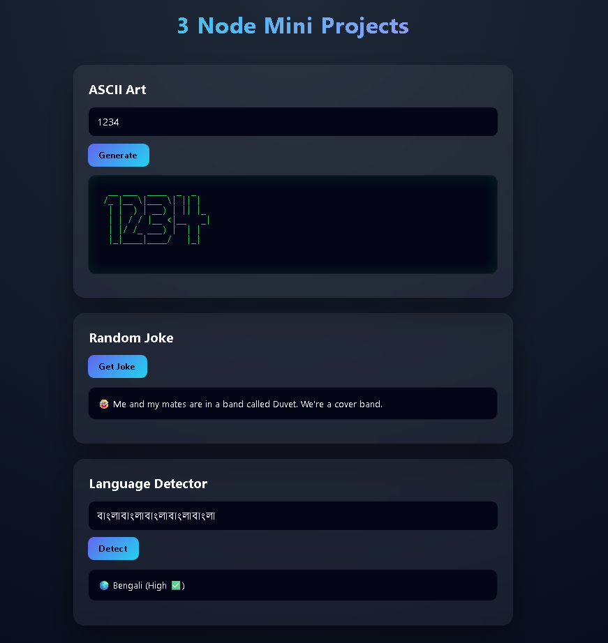

### README.md

This project is a small but well-structured **Node.js + Express mini-app suite** with a single backend and a browser-based frontend. It exposes three services—ASCII Art generation, Random Jokes, and Language Detection—via clean APIs and a modern UI.

---

### Requirements

* Node.js **v18+** (recommended)
* npm (comes with Node)

Check installation:

```bash
node -v
npm -v
```

---

### Installation (do this first)

From the **root folder**:

```bash
npm install
```

This installs all dependencies required by the backend and services.

---

### Running the app

Start the server:

```bash
node server.js
```

You should see:

```
🚀 Server running on http://localhost:3000
```

Now open your browser and go to:

```
http://localhost:3000
```

---



### What’s included

**1. ASCII Art Generator**

* Converts text into bold, readable ASCII art
* Uses improved Figlet settings and proper monospace rendering
* API: `POST /api/ascii`

**2. Random Joke Generator**

* Fetches dad jokes asynchronously
* Clean JSON response with metadata
* API: `GET /api/joke`

**3. Language Detector**

* Detects language from natural sentences
* Handles unclear input gracefully with hints
* API: `POST /api/language`

---

### Project structure (overview)

```
├── server.js              # Express server & API routes
├── services/              # Pure logic (no Express)
│   ├── asciiArt.js
│   ├── jokes.js
│   └── language.js
├── public/                # Frontend (served statically)
│   ├── index.html
│   ├── app.js
│   └── styles.css
├── README.md
└── project-tree.txt
```

---

### Why this structure matters

* Clear **service layer separation**
* Easy to extend (new APIs, tests, CLI reuse)
* Frontend and backend cleanly decoupled
* Real-world Express project layout (not a toy setup)

---

### Notes

* No database required
* No environment variables needed
* Works fully in the browser (not terminal-based)

If you want, this can be extended with:

* Font selector for ASCII art
* Caching for jokes
* TypeScript conversion
* API documentation (OpenAPI)

Just say the word.
